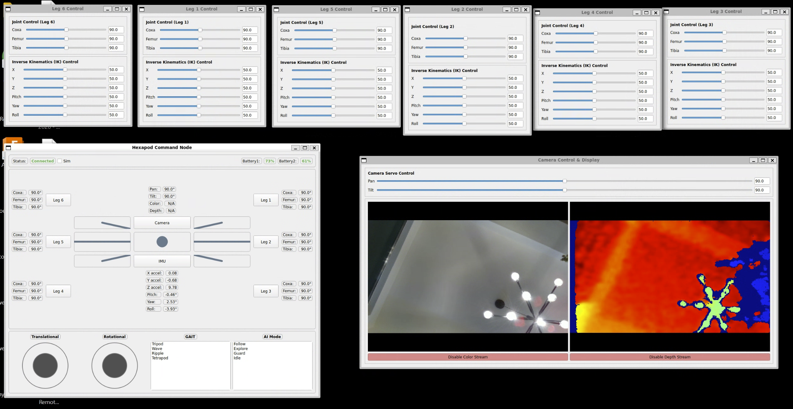
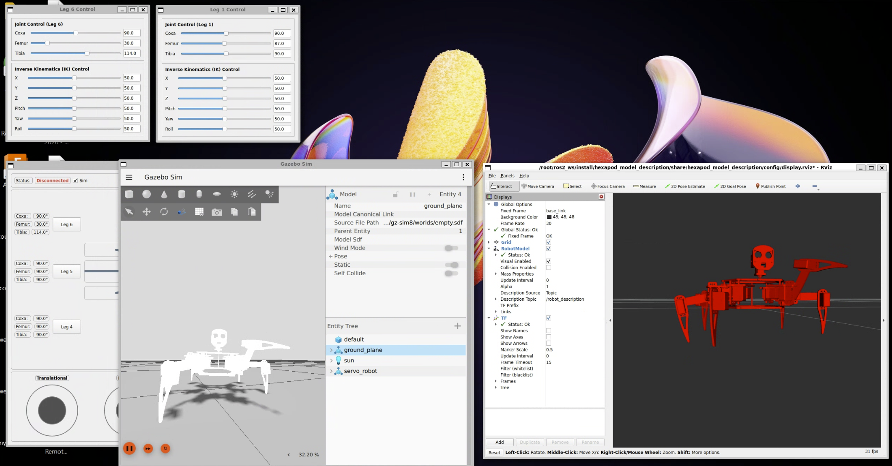

# ROS2 Jazzy Hexapod Robot with Raspberry Pi 5

## Table of Contents
1. [Project Overview](#project-overview)
2. [Github IO Project Page](#github-io-project-page)
    - [Project Goals](#project-goals)
    - [Robot Assembly](#robot-assembly-skip-if-doing-sim-only)
    - [Download STL Meshes](#download-the-stl-meshes-for-the-simulation)
3. [Setup Instructions](#setting-up-dockerwsl-on-windows)
    - [Docker/WSL on Windows](#setting-up-dockerwsl-on-windows)
    - [Docker on Raspberry Pi 5](#setting-up-docker-on-raspberry-pi-5-skip-if-doing-sim-only)
4. [Running the Application](#starting-the-applications)
    - [On WSL](#on-wsl)
    - [On the Pi](#on-the-pi-skip-if-using-sim-only)
    - [Network Setup](#network-setup-skip-if-using-sim-only)
5. [Hardware](#hardware)
6. [Contributing](#contributing)
7. [Acknowledgements](#thank-you-to-freenova)


## Project Overview
[WSL Ubuntu 24.04.1 Noble, Docker, ROS2 Jazzy, Gazebo Sim Harmonic]
Containerized, Fully Simulated, No Robot Required

Robot Purchasing Information: Freenove Big Hexapod Robot kit for Raspberry Pi (FNK0052)
- [Freenove Big Hexapod Robot Kit FNK0052 - Amazon Link](https://amzn.to/47vyFz6)
- [Raspberry Pi 5 - Amazon Link](https://amzn.to/45EQbOT)
- [Intel Realsense Depth Camera D435 - Amazon Link](https://amzn.to/46X4d0F)

Screenshot of current Command GUI



Screenshot of RViz and Gazebo connected to Command GUI




## Github IO Project Page

https://ogordillo.github.io/ROS2_Conversion_Freenove_Big_Hexapod_Robot_Raspberry_Pi/

Github IO Page where I post updates on the project. This blog includes pictures, videos and talks about things that worked or didn't worked. 

### Project Goals
- Creating a Digital Twin with Fusion360 
- Develop a distributed network to leverage remote resources (think GPUs, Databases, Sensors, etc.)
- Implement Forward/Inverse Kinematics, GAITS, PIDs in Python
- Implementing SLAM for Path Planning
- Implement AI models for object avoidance, obstacle climbing.
- Implement a Gazebo Simulation environment to train AI models.
- Modify the Robot with additional power resources and sensors.

### Robot Assembly (skip if doing Sim Only)
For assembly - the best place to start is by following Freenova's kit Tutorial.pdf. This is available in the branch: <a href="[link](https://github.com/ogordillo/ROS2_Conversion_Freenove_Big_Hexapod_Robot_Raspberry_Pi/tree/original)">original</a> or by following the steps from Freenove project <a href="[link](https://github.com/Freenove/Freenove_Big_Hexapod_Robot_Kit_for_Raspberry_Pi)">Freenove_Big_Hexapod_Robot_Kit_for_Raspberry_Pi</a>

First assemble the robot and test it to be operational.

### Download the STL meshes for the simulation

https://drive.google.com/drive/folders/1VZxh9XcH7hnItRFQC2-phcYuDbOMEweY?usp=sharing

Place the meshes folder in src/hexapod_model_description/meshes

The URDF was created using <a href="https://github.com/runtimerobotics/fusion360-urdf-ros2">this exporter</a>

The meshes for the URDF files and the original CAD models from the vendor are on my google drive link above.

## Setting up Docker/WSL on Windows

Instructions are in the README.md in src/windows_command/README.md

## Setting up Docker on RaspberryPi 5 (skip if doing Sim Only)

Instructions are in the README.md in src/pi_control/README.md

## Starting the Applications
Instructions for running the pi_control and windows_command containers. 

### On WSL
```
docker-compose up windows_command --build
```
##### On a seperate terminal while the command gui is running,
```
gazebo_hexapod
```
##### On yet another terminal while the command gui is running,
```
rviz_hexapod
```
### On the Pi (skip if using Sim Only)
```
docker-compose up pi_control --build
```


### Network Setup (skip if using Sim Only)
This project uses Zenoh (Middleware) for ROS2 discovery.

I've had issues getting UDP to work on anything but my home wifi.

Replace the ip address in config/client_config.yaml with the ip address of your Pi.
```
connect:
  endpoints:
    - udp/<your ip>:7447
    - tcp/<your ip>:7447
```

### Hardware
The main hardware components of this project:
- Freenove FNK0052 kit
- Raspberry Pi 5
- Windows 11 laptop with WSL2
- Intel Realsense Depth Sensor
- 4S ~14v Battery (optional)


### Contributing
Contributions are welcome! If you have an idea, find a bug, or want to add a new feature, please open an issue or submit a pull request. 

### Thank you to Freenova
I'd like to thank the ppl at Freenove for being awesome and making applications like this available open source, no strings attached. This is the way. 🙏

