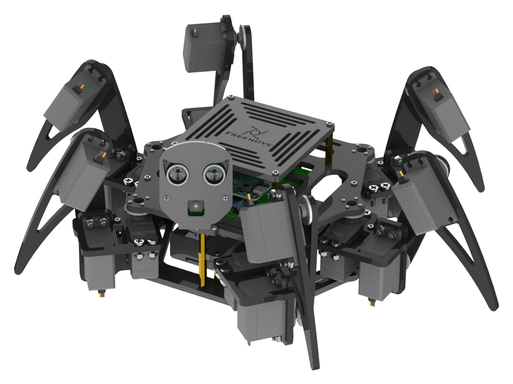

# ROS2 implementation of Freenove Big Hexapod Robot kit for Raspberry Pi (FNK0052)

### Thank you to Freenova
Firstly, I'd like to thank the ppl at Freenove for being awesome and making applications like this available open source, no strings attached. This is the way. 🙏

## <a href="https://ogordillo.github.io/ROS2_Conversion_Freenove_Big_Hexapod_Robot_Raspberry_Pi/">Github IO Project Page</as>

### This is the github page where I post updates on the project. This blog includes pictures, videos and talks about things that worked or didn't worked. 

## ROS2 Development

### Project Goals
- Creating a Digital Twin with Fusion360
- Develop a distributed network to leverage remote resources (think GPUs, Databases, Sensors, etc.)
- Implement Forward/Inverse Kinematics, GAITS, PIDs in Python
- Implementing SLAM for Path Planning
- Implement AI models for object avoidance, obstacle climbing.
- Implement a Gazebo Simulation environment to train AI models.
- Modify the Robot with additional power resources and sensors.

### Starting Out
For assembly - the best place to start is by following Freenova's kit Tutorial.pdf. This is available in the branch: <a href="[link](https://github.com/ogordillo/ROS2_Conversion_Freenove_Big_Hexapod_Robot_Raspberry_Pi/tree/original)">original</a> or by following the steps from Freenove project <a href="[link](https://github.com/Freenove/Freenove_Big_Hexapod_Robot_Kit_for_Raspberry_Pi)">Freenove_Big_Hexapod_Robot_Kit_for_Raspberry_Pi</a>

Once the robot is assembled and operational, there are README.md files in the respective component folders to guide you through setting up the docker containers and nuances between the platforms.
Nodes/Interfaces are in src/

- src
  - pi_control [Runs on the pi and controls the servos/sensors]
  - windows_command [Runs on a remote laptop and commands]
  - robot_interfaces [Runs on both, defines custom communication]
  - Hexapod_Robot_description [Runs on remote laptop, visualizes/simulates]
  
### Docker Containers
- docker
  - docker.pi
  - docker.wsl (windows)

Easy build/run with docker-compose

### URDF Mesh Files
<a href="https://drive.google.com/drive/folders/1VZxh9XcH7hnItRFQC2-phcYuDbOMEweY?usp=sharing">Google Drive Assets</a>

The URDF was created using <a href="https://github.com/runtimerobotics/fusion360-urdf-ros2">this exporter</a>
The meshes for the URDF files are on my google drive as well as the original CAD models from the vendor. 

### Network Setup
This project uses Zenoh (Middleware) for ROS2 discovery.

### Hardware
The main hardware components of this project:
- Freenove FNK0052 kit
- Raspberry Pi 5
- Windows 11 laptop with WSL2
- Intel Realsense Depth Sensor
- 4S ~14v Battery

### Contributing
Contributions are welcome! If you have an idea, find a bug, or want to add a new feature, please open an issue or submit a pull request. 

