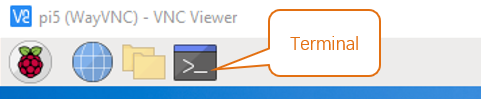
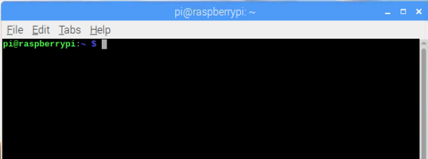
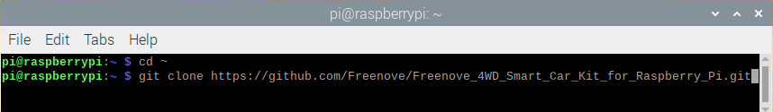
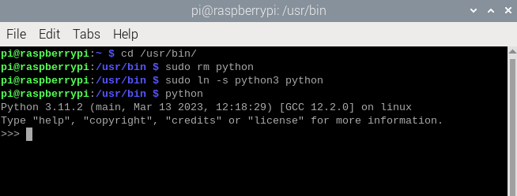
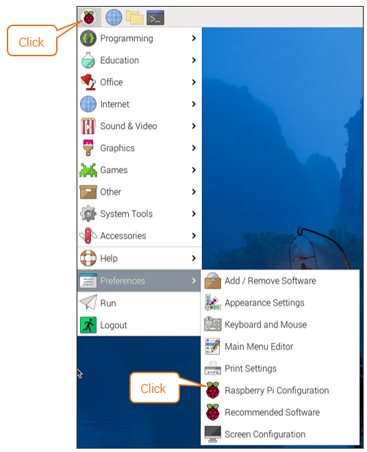
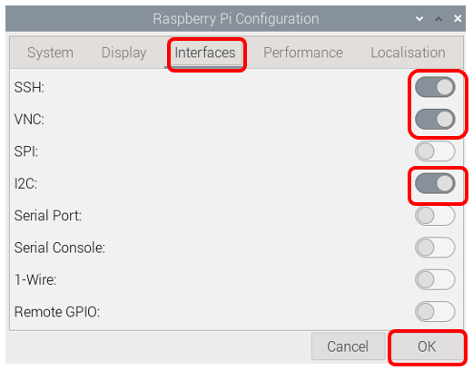
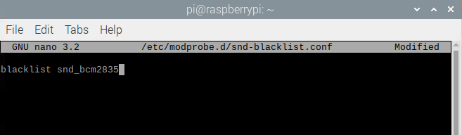
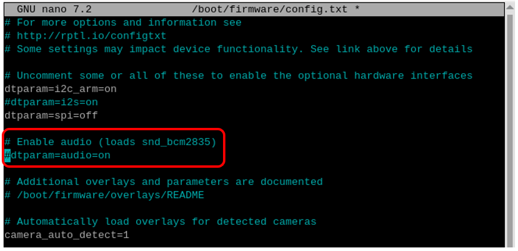

##############################################################################
Chapter 1 Software installation and Test (necessary)
##############################################################################

**If you have any concerns, please feel free to contact us via support@freenove.com**

In this chapter, we will make some necessary preparation: start your Pi Raspberry and install some necessary libraries. Then test some parts. Batteries are needed when driving peripherals such as motors, servos, LEDs, etc.

.. note::   

    1. :combo:`red font-bolder:Please use Raspberry Pi OS with Desktop`
    
    2. The installation of libraries takes much time. :combo:`red font-bolder:You can power Raspberry Pi with a power supply Cable.`
    
    3. If you are using **remote desktop** to login Raspberry Pi, you need to use :ref:`VNC viewer <VNC>`.

You can watch this video while reading this chapter.

**We will help you with any concerns via** support@freenove.com

.. raw:: html

   <iframe style="display: block; margin: 0 auto;" height="421.875" width="750" src="https://www.youtube.com/embed/cVrwOoORItE" frameborder="0" allowfullscreen></iframe>

Step 1 Obtain the Code and Set python3 as Default
****************************************************************

To download the code, you can power Raspberry Pi with a power supply cable or switch on S1 (Power Switch). Then open the Raspberry Pi and the terminal. You can open the terminal by clicking as shown below, or you can press “CTRL + ALT + T” on the desktop.

The terminal is shown below:

Enter the following commands in the terminal to obtain the robot’s code and save it to the user’s directory” Pi”. (Note that here are two commands, please enter them one by one in order.)

.. code-block:: console

    $ cd
    $ git clone --depth 1 https://github.com/Freenove/Freenove_Big_Hexapod_Robot_Kit_for_Raspberry_Pi.git

Downloading takes some time. Please wait with patience. 

You can also find and download the code by visiting our official website (http://www.freenove.com) or our GitHub repository (https://github.com/freenove).

.. note:: 

    :combo:`red font-bolder:All codes of the robot are written with Python3. If run with Python2, it may cause errors.`

Set Python3 as default python (Necessary)
================================================================

First, execute python to check the default python on your Raspberry Pi. Press Ctrl-Z to exit.

If it is python3, you can skip this section.

**If it is python2, you need execute the following commands to set default python to python3.**

1.	Enter directory /usr/bin 

.. code-block:: console

    $ cd /usr/bin

2.	Delete the original python link.

.. code-block:: console

    $ sudo rm python

3.	Create new python links to python.

.. code-block:: console

    $ sudo ln -s python3 python

4.	Check python. Press Ctrl-Z to exit.

.. code-block:: console

    $ python 

If you want to set python2 as default python in **other projects**, just repeat the commands above and change python3 to python2.

Shortcut Key
----------------------------------------------------------------

Now, we will introduce several shortcuts that are very :combo:`red font-bolder:useful` and :combo:`red font-bolder:commonly used` in terminal.

1. **up and down arrow keys.** History commands can be quickly brought back by using up and down arrow keys, which are very useful when you need to reuse certain commands.

  When you need to type commands, pressing “**↑**” will go backwards through the history of typed commands, and pressing “**↓**” will go forwards through the history of typed command.

2. **Tab key.** The Tab key can automatically complete the command/path you want to type. When there are multiple commands/paths conforming to the already typed letter, pressing Tab key once won’t have any result. And pressing Tab key again will list all the eligible options. This command/path will be completely typed as soon as you press the Tab key when there is only one eligible option.

As shown below, under the '~'directory, enter the Documents directory with the “cd” command. After typing “cd D”, press Tab key, then there is no response. Press Tab key again, then all the files/folders that begin with “D” is listed. Continue to type the character "oc", then press the Tab key, and then “Documents” is completely typed automatically.

|

Step 2 Configuration
****************************************************************

Enable I2C and VNC
================================================================

The I2C interface Raspberry Pi is disabled by default. You need to open it manually. 

.. note:: 
    
    :combo:`red font-bolder:If your connector version is V2.0, remember to turn on the SPI feature. If your connector version is V1.0, turn off the SPI feature.`

Set I2C Baud Rate
=================================================================

Open the terminal and enter the following command.

.. code-block:: console
    
    $ sudo nano /boot/firmware/config.txt

The default I2C Baud Rate is 100000. Now we change it to 400000, because this can speed up the response speed of the servos to make robot dog walk faster. If the baud rate is 100,000, the robot walks slowly.

Scrolling the middle of the mouse to find **dtparam=i2c_arm=on, and add “i2c_arm_baudrate=400000”**.

.. image:: ../_static/imgs/1_Software_installation/Chapter1_15.png
    :align: center

:combo:`red font-bolder:Press "CTRL"+"O" and then "Enter" to save the modified content. Then press "CTRL"+"X" to exit editing.`

After the modification is completed, reboot Raspberry Pi to make the change work. You can also reboot the Raspberry Pi after completing the step 3 below.

Type a command to check whether the I2C module is enabled:

.. code-block:: console
    
    $ lsmod | grep i2c

If I2C module has been enabled, the following content will show up (the numbers showing in your device may be different):

.. image:: ../_static/imgs/1_Software_installation/Chapter1_16.png
    :align: center

Install I2C-Tools
----------------------------------------------------------------

Type the command to install I2C-Tools.

.. code-block:: console

    $ sudo apt-get install i2c-tools

Install python-smbus
----------------------------------------------------------------

Python-smbus is a module of the program Python, which contains some classes and methods to operate I2C.

Type the following command to install python-smbus:

.. code-block:: console

    $ sudo apt-get install python3-smbus

Additional supplement 
----------------------------------------------------------------

Raspbery Pi, other than 5, 4B and 400, needs to disable the audio module, othewise the LED will not work properly.

1.	Create a new snd-blacklist.conf and open it for editing

.. code-block:: console

    $ sudo nano /etc/modprobe.d/snd-blacklist.conf

Add following content: After adding the contents, you need to press Ctrl+O, Enter, Ctrl+Z.

.. code-block:: console

    $ blacklist snd_bcm2835

2.	We also need to edit config file.

.. code-block:: console

    $ sudo nano /boot/config.txt

Find the contents of the following two lines (with Ctrl + W you can search):

.. code-block:: console

    # Enable audio (loads snd_bcm2835)
    dtparam=audio=on

Add # to comment out the second line. Press Ctrl+O, Enter, Ctrl+X.

.. code-block:: console

    # Enable audio (loads snd_bcm2835)
    # dtparam=audio=on

It will take effect after restarting, and you can restart after executing the next section. 

If you want to restart the audio module, just restore the content modified in the above two steps.

Step 3 Execute the Installed Program
****************************************************************

1.	Execute following commands to enter directory of “setup.py”.

.. code-block:: console

    $ cd ~/Freenove_Big_Hexapod_Robot_Kit_for_Raspberry_Pi/Code
    
2.	Run setup.py

.. code-block:: console

    $ sudo python setup.py

This program will automatically install the rpi_ws281x, PyQt5 library, etc. Please reboot the Raspberry Pi after the installation is completed, as shown below.

If it is your first time to run the script, it will ask you to input the camera type. At this point, input the content according to the camera you have. (The one included in this kit is of the type ov5647).

.. image:: ../_static/imgs/1_Software_installation/Chapter1_17.png
    :align: center

.. list-table::
    :header-rows: 1
    :align: center
    :class: table-line

    * - OV5647
      - Imx219

    * - |Chapter1_18|
      - |Chapter1_19|

.. |Chapter1_18| image:: ../_static/imgs/1_Software_installation/Chapter1_18.png
.. |Chapter1_19| image:: ../_static/imgs/1_Software_inst   allation/Chapter1_19.png

If your Rpi is a Pi 5, it will ask you which camera interface to use. You can type in cam0 or cam1 based on the interface you want to use.

.. note::
    
    :combo:`red font-bolder:Make sure you connect the camera cable to the corresponding interface.`

If it is not Raspberry Pi, this setting is not needed, as there is only camera interface available.

.. image:: ../_static/imgs/1_Software_installation/Chapter1_20.png
    :align: center

.. image:: ../_static/imgs/1_Software_installation/Chapter1_21.png
    :align: center

Reboot your Raspberry Pi after installing the libraries.

.. code-block:: console
    
    sudo reboot

.. image:: ../_static/imgs/1_Software_installation/Chapter1_22.png
    :align: center

:combo:`red font-bolder:The reboot of the pi takes some time, please wait with patience.`

If the installation fails, please rerun setup.py. After the installation is completed, restart the Raspberry Pi. Most installation failures are caused by network reasons.

.. code-block:: console
    
    sudo python setup.py