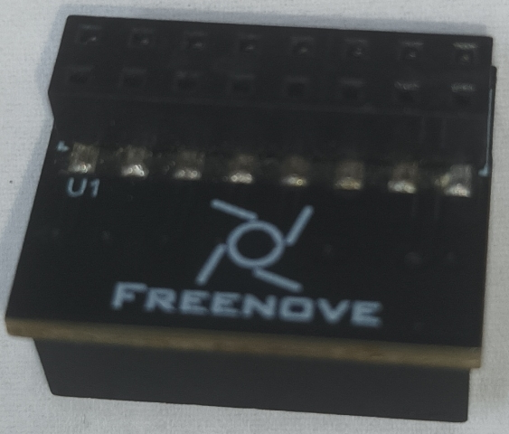
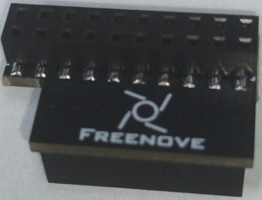

##############################################################################
Chapter 2 Assembly of the Robot (Important)
##############################################################################

You can watche this video while reading this chapter: https://youtu.be/l4R5f8EvvPo

.. raw:: html

   <iframe style="display: block; margin: 0 auto;" height="421.875" width="750" src="https://www.youtube.com/embed/l4R5f8EvvPo" frameborder="0" allowfullscreen></iframe>

We will help you with any concerns via support@freenove.com

Step 1 Installing Servo Base
****************************************************************

Take out the disc servo arms from the servo package.

.. image:: ../_static/imgs/2_Assembly/Chapter2_00.png
    :align: center

Fix each disc servo arm to the joints.   

|

After all disc servo arms are installed successfully, it should look as follows:

Step 2 Installing Servos
****************************************************************

Installing Servos on the Legs
================================================================

Install servos on the lower legs

The other 5 leg parts are installed in the same way. 

.. note::
    
    :red:`The robot has six legs and its left lower legs and right lower legs are in different directions.`

Installation of servos on the hip joints of the three left legs.

Assembly

.. image:: ../_static/imgs/2_Assembly/Chapter2_44.png
    :align: center

Installation of servos on the hip joints of the three right legs.

Assembly

Servos at left and right hip joints (Note: the direction of servos on each side is different.)

Step 3 Assembling the center of the body
****************************************************************

Installing Control Board
================================================================

Installing control board

|

Installing LED Module
================================================================

Wiring

Installing MPU6050 Module
================================================================

.. note::
    
    There are two rows of female header, please plug the module into the right.

Installing Raspberry Pi
================================================================

Installing Connector
================================================================

Install the comection board

**We have two types of connection boards, but they are installed in the same way.**

See :ref:`here <Electronic>` for more information.

.. list-table:: 
    :width: 60%
    :align: center
    :class: table-line
    :header-rows: 1

    *   -   Connection board (PCB_V1.0)  
        -   Connection board (PCB_V2.0)

    *   -   |List22|
        -   |List23|

Installing Brass Standoff
================================================================

Installing Servo Arms
================================================================

Step 4 Installing Battery Holder
****************************************************************

|

.. image:: ../_static/imgs/2_Assembly/Chapter2_45.png
    :align: center

Step 5 Assembling Legs and Head to the Body
****************************************************************

Run the servo installation program
================================================================

Before installing, fix the servos at the specified angle. At this point you need to run the servo program.

Plug batteries into the battery holder. And then plug the battery holder to control board.

Press S1 and S2.

Open Raspberry Pi. (All contents in Chapter 1 should be executed correctly first. If not, please return Chapter 1 to finish it first.)

a. Enter the following command to enter the directory where the servo program locates.

.. code-block:: console
    
    $ cd ~/Freenove_Big_Hexapod_Robot_Kit_for_Raspberry_Pi/Code/Server

b. Execute the following command to run “Servo.py”.

.. code-block:: console
    
    $ sudo python Servo.py

.. image:: ../_static/imgs/2_Assembly/Chapter2_47.png
    :align: center

Next, fix each servo to the corresponding disc servo arm. :combo:`red font-bolder:Do NOT pull the servo wires` during the installation process.

Installing Hip Joint
================================================================

Connect the servo wires to corresponding servo port.

.. image:: ../_static/imgs/2_Assembly/Chapter2_24.png
    :align: center

|

.. image:: ../_static/imgs/2_Assembly/Chapter2_46.png
    :align: center

|

Installing Lower Leg and the Head
================================================================

Connect the servo wires to corresponding servo port.

|

Asseble 6 standoff

Connect a 4P cable which will be used later.

|

Installing head
================================================================

.. list-table:: 
    :widths: 50 50
    :align: center
    :class: table-line

    *   -   |Chapter2_31|
        -   |Chapter2_32|
    *   -   |Chapter2_33|
        -   |Chapter2_34|
    *   -   |Chapter2_35|
        -   |Chapter2_36|
    *   -   |Chapter2_37|
        -   |Chapter2_38|
  

.. |Chapter2_36| image:: ../_static/imgs/2_Assembly/Chapter2_36.png

Connecting Wires of Camera and Ultrasonic Module
================================================================

Connect camera wire

:combo:`bg-blue font-bolder:You need power off Raspberry Pi when wire camera.`

After connected, it should be as follows

.. image:: ../_static/imgs/2_Assembly/Chapter2_40.png
    :align: center

Connecting Ultrasonic Module

.. note::
    
    VCC, Echo, Trig, GND are connected to VCC, Echo, Trig and GND on the connection board respectively. Do NOT connect them wrongly. Otherwise, it may burn out the Ultrasonic module.

Step 6 Installing Base and Cover Plates
****************************************************************

|

Congratulations! You have finished the assembly of the robot.
