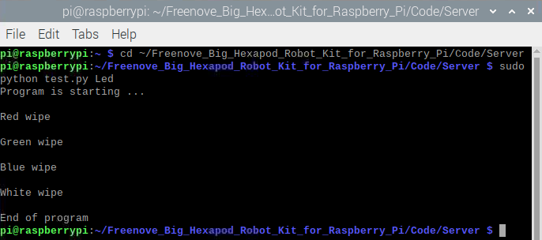

##############################################################################
Chapter 3 Module Test (necessary)
##############################################################################

In the previous chapter, we have assembled the robot. In this chapter, we will test all modules of the robot to see whether they work.

Before starting, please plug in the batteries, and switch ON S1 and S2. Place the assembled robot on a horizontal table and make sure that the wiring of each servo is correct. 

If you have never learned python before, you can learn some basic knowledge via the link below: https://python.swaroopch.com/basics.html

You can watch this video while reading this chapter.

.. raw:: html

   <iframe style="display: block; margin: 0 auto;" height="421.875" width="750" src="https://www.youtube.com/embed/D00LdVqXC5E" frameborder="0" allowfullscreen></iframe>

**We will help you with any concerns via** support@freenove.com

Servo
****************************************************************

Enter the following command to check I2C.

.. code-block:: console

    i2cdetect -y 1

As shown in the following illustration, the address of two PCA9685 chips are 0x40 and 0x41 respectively, the address of ADS7830 chip is 0x48 and the address of MPU6050 module is 0x68。 

Run program
================================================================

Enter following commands in the terminal to test servos.

If the terminal displays the directory as below (where test.py is located). You can directly execute the test.py command. 

.. image:: ../_static/imgs/3_Module_Test/Chapter3_01.png
    :align: center

1.	If not, execute the cd command:

.. code-block:: console

    $ cd ~/Freenove_Big_Hexapod_Robot_Kit_for_Raspberry_Pi/Code/Server

2.	Execute test.py command:

.. code-block:: console

    $ sudo python test.py Servo

Result
----------------------------------------------------------------

In the previous chapter, we have assembled the robot and executed the servo installation program, which makes the six legs of the robot straight.

After running the servo test program, the robot slowly rotates its six legs clockwise from the original straight state, and then lifts the legs up, and finally stands with the lower leg extended back. If the sequence of the movement of your robot is different, please check whether the wiring is correct.

Code
================================================================

The code is as below:

.. literalinclude:: ../../../freenove_Kit/Code/Server/test.py
    :linenos: 
    :language: python
    :lines: 43-74

Reference
----------------------------------------------------------------

.. py:function:: setServoAngle(channel, angle)

    There are two parameters in this function to rotate the servo of specified channel to a specified angle.
    
    The first parameter indicates the servo channel
    
    The second parameter indicates the rotation angle
    
    For example:
    
    setServoAngle(0,60)         Rotate servo of channel 0 to 60 degrees
    
    setServoAngle(15,160)     Rotate servo of channel 15 to 160 degrees

ADC Module
****************************************************************

Run program
================================================================

Enter following commands to test ADC module.

If the terminal displays the directory as below (where test.py is located). You can directly execute the test.py command. 

.. image:: ../_static/imgs/3_Module_Test/Chapter3_04.png
    :align: center

1.If not, execute the cd command:

.. code-block:: console

    $ cd ~/Freenove_Big_Hexapod_Robot_Kit_for_Raspberry_Pi/Code/Server

2.Execute test.py command:

.. code-block:: console

    $ sudo python test.py ADC

Result
----------------------------------------------------------------

Print out the voltage value of two sets of batteries every one second, You can press "Ctrl + C" to end program.

Code
================================================================

.. literalinclude:: ../../../freenove_Kit/Code/Server/test.py
    :linenos: 
    :language: python
    :lines: 77-86
    :dedent:

Reference
----------------------------------------------------------------

.. py:function:: read_battery_voltage()

    Return the voltage value of the battery, retaining two decimal places.
    
Ultrasonic module
****************************************************************

Run program
================================================================

Enter the following command in the terminal to test the ultrasonic module:

If the terminal displays the directory as below (where test.py is located). You can directly execute the test.py command. 

.. image:: ../_static/imgs/3_Module_Test/Chapter3_06.png
    :align: center

1.	If not, execute the cd command:

.. code-block:: console

    $ cd ~/Freenove_Big_Hexapod_Robot_Kit_for_Raspberry_Pi/Code/Server

2.	Execute test.py command:

.. code-block:: console

    $ sudo python test.py Ultrasonic

.. image:: ../_static/imgs/3_Module_Test/Chapter3_07.png
    :align: center

Result
----------------------------------------------------------------

Every 1s, the distance between the obstacle and the ultrasonic module will be printed in, and you can press "Ctrl + C" to end the program.

Code
================================================================

The code is as below:

.. literalinclude:: ../../../freenove_Kit/Code/Server/test.py
    :linenos: 
    :language: python
    :lines: 33-41

Reference
----------------------------------------------------------------

.. py:function:: get_distance()

    This function is used to obtain the distance of ultrasonic module and front obstacle, with unit CM.

Led
****************************************************************

.. note::
    
    :combo:`red font-bolder:Raspberry PI 5 is temporarily unavailable because the Library rpi-ws281x-python does not support Raspberry PI 5. Please skip this section.`

There is an LED module on the robot, as shown below:

Run program
================================================================

Enter the following commands to test LED.

If the terminal displays the directory as below (where test.py is located). You can directly execute the test.py command. 

1.If not, execute the cd command:

.. code-block:: console

    $ cd ~/Freenove_Big_Hexapod_Robot_Kit_for_Raspberry_Pi/Code/Server

2.Execute test.py command:

.. code-block:: console

    $ sudo python test.py Led

If you are using the Led feature for the first time, it will ask for the PCB version of the connection board.

.. image:: ../_static/imgs/3_Module_Test/Chapter3_10.png
    :align: center

Please enter 1 or 2 according to the version number of your connection board.

.. list-table:: 
    :width: 60%
    :align: center
    :header-rows: 1

    *   -   Connection board (PCB_V1.0)  
        -   Connection board (PCB_V2.0)

    *   -   |List22|
        -   |List23|

.. |List22| image:: ../_static/imgs/List/List22.png
    :width: 83%
.. |List23| image:: ../_static/imgs/List/List23.png

|

:red:`If your connection board version is V2.0 and you do not have the SPI feature turned on, the LedPixel will not show the color. Refer here to turn on the SPI`

Result
----------------------------------------------------------------

The LED lights up with the color of red, green, blue and white in turn and then it turns OFF. You can end the program ahead of time by pressing "ctrl+c". 

If the LED color display order is not correct, open the "**Led.py**" file in the current directory and modify the value of the "self.ORDER" variable on line 16.

Code
================================================================

The code of test.py is as below:

.. literalinclude:: ../../../freenove_Kit/Code/Server/test.py
    :linenos: 
    :language: python
    :lines: 3-30

Reference
----------------------------------------------------------------

.. py:function:: colorWipe(color, wait_ms)

    This function erases the color of one pixel at a time, has two input parameters, color represents the color to be erased, and wait_ms represents the erasure interval. The default is 50ms. For example, colorWipe([255,0,0],20) means that the LED0 color is red first, wait for 20ms, and then the LED1 color is also red, so that all eight LEDs are lit and red.

Buzzer
****************************************************************

Run the program
================================================================

Enter following command in the terminal to test buzzer.

If the terminal displays the directory as below (where test.py is located). You can directly execute the test.py command. 

.. image:: ../_static/imgs/3_Module_Test/Chapter3_12.png
    :align: center

1.If not, execute the cd command:

.. code-block:: console

    $ cd ~/Freenove_Big_Hexapod_Robot_Kit_for_Raspberry_Pi/Code/Server

2.Execute test.py command:

.. code-block:: console

    $ sudo python test.py Buzzer

Result
----------------------------------------------------------------

The buzzer will be turn on lasting for 3s. Then the program will automatically end or you can press "Ctrl + C" to end the program.

Code
================================================================

.. literalinclude:: ../../../freenove_Kit/Code/Server/test.py
    :linenos: 
    :language: python
    :lines: 89-103

Reference
----------------------------------------------------------------

.. py:function:: buzzer.set_state(cmd)

    This function has one input parameter. If the input is True, the buzzer will be turned on. If the input is False, the buzzer will be turned off. 

Camera
****************************************************************

Run program
================================================================

1.	execute the cd command:

.. code-block:: console

    $ cd ~/Freenove_Big_Hexapod_Robot_Kit_for_Raspberry_Pi/Code/Server

2.	Execute test.py command:

.. code-block:: console

    $ python camera.py

Then please open and check the generated image.jpg under

/Freenove_Big_Hexapod_Robot_Kit_for_Raspberry_Pi/Code/Server. 

.. image:: ../_static/imgs/3_Module_Test/Chapter3_14.png
    :align: center

Then please open and check the generated image.jpg under

/Freenove_Big_Hexapod_Robot_Kit_for_Raspberry_Pi/Code/Server. 

.. image:: ../_static/imgs/3_Module_Test/Chapter3_15.png
    :align: center
