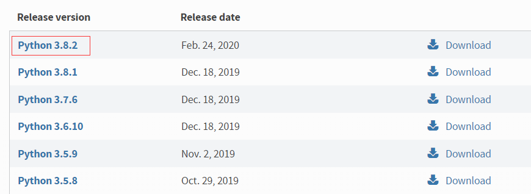
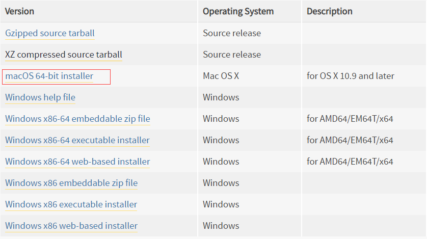
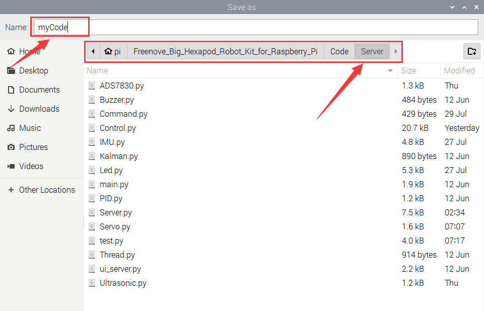

##############################################################################
Chapter 4 Hexapod Robot
##############################################################################

**You can refer to these videos to open client and calibrate the robot:**

**Client control:**

.. raw:: html

   <iframe style="display: block; margin: 0 auto;" height="421.875" width="750" src="https://www.youtube.com/embed/KlxxgnW6uyo" frameborder="0" allowfullscreen></iframe>

**Calibration:**

.. raw:: html

   <iframe style="display: block; margin: 0 auto;" height="421.875" width="750" src="https://www.youtube.com/embed/NdXG3wmdufI" frameborder="0" allowfullscreen></iframe>

The robot features with live video, ultrasonic ranging and other functions. Based on Python3 and PyQt5, it has also been built with server and client, which communicate with each other through TCP/IP protocol and can be controlled remotely with the same LAN.  

**We will help you with any concerns via** support@freenove.com

Server
****************************************************************

The server runs on the Raspberry Pi. It sends the camera data and ultrasonic module data to the client, and receive commands from client.

**The code in the Server folder is used as an example, or if you has a Raspberry Pi5, refer to the code in the server-PI5 folder.**

Code
================================================================

Part of the server code is as follows:

.. literalinclude:: ../../../freenove_Kit/Code/Server/Server.py
    :linenos: 
    :language: python
    :lines: 45-77
    :dedent:

Reference
----------------------------------------------------------------

For more code, please check “Server.py” in the Server directory.

.. py:function:: get_interface_ip()	

    To obtain the IP address of RPi's WLAN0

.. py:function:: start_server()	

    To turn ON TCP to wait for the connection of Client 

.. py:function:: stop_server()	

    To turn OFF TCP

.. py:function:: send_data()	

    To send commands to client

.. py:function:: reset_server ()	

    To restart TCP

.. py:function:: transmit_video()	

    To send video data to client

.. py:function:: receive_commands()	

    To receive commands from client

Open Server
================================================================

Step 1 Login Raspberry Pi via VNC viewer 
----------------------------------------------------------------

:combo:`red font-bolder:Because server and client use GUI. You need use VNC viewer as remote desktop way.`

Download and install VNC Viewer according to your computer system by clicking following link:

https://www.realvnc.com/en/connect/download/viewer/

After installation is completed, open VNC Viewer. And click File -> New Connection. Then the interface is shown below. 

.. image:: ../_static/imgs/4_Hexapod_Robot/Chapter4_01.png
    :align: center

Enter IP address of your Raspberry Pi and fill in a Name. And click OK.

Then on the VNC Viewer panel, double-click new connection you just created, and the following dialog box pops up. Enter username: :combo:`blue font-bolder:pi` and Password: :combo:`blue font-bolder:raspberry`. And click OK.     

.. image:: ../_static/imgs/4_Hexapod_Robot/Chapter4_02.png
    :align: center

:combo:`red font-bolder:If the resolution ratio is not great or there is just a` **little window**:combo:`red font-bolder:, you can set a proper resolution ratio via steps below.`

Select Screen Configuration. Select the appropriate resolution in the new window. Click Apply. 

In addition, your VNC Viewer window may zoom your Raspberry Pi desktop. You can change it. On your VNC View control panel, click right key. And select Properties->Options label->Scaling. Then set proper scaling.

Step 2 Run commands
----------------------------------------------------------------

Enter following command in the terminal.

1.	Use cd command to enter directory where main.py is located:

.. code-block:: console

    $ cd ~/Freenove_Big_Hexapod_Robot_Kit_for_Raspberry_Pi/Code/Server

2.	Run main.py:

.. code-block:: console

    $ sudo python main.py

The interface is as below:

If you don't like the interface, you can also enter the commands to open the server. It is more convenient.

1.	Use cd command to enter directory where main.py is located:

.. code-block:: console

    $ cd ~/Freenove_Big_Hexapod_Robot_Kit_for_Raspberry_Pi/Code/Server

2.	Run main.py:

.. code-block:: console

    $ sudo python main.py -t -n

or Run main,py with following command:

.. code-block:: console

    $ sudo python main.py -tn

"-t" means open TCP communication. "-n" means don't show interface.

Sever Auto Start
^^^^^^^^^^^^^^^^^^^^^^^^^^^^^^^^^

1. Open the terminal and execute the following two commands respectively to create a “start.sh” file.

.. code-block:: console

    $ cd ~
    $ sudo touch start.sh

2. Open “start.sh”.
   
.. code-block:: console

    $ sudo nano start.sh

3. Add the following contents to “start.sh” file.
   
.. code-block:: shell

    #!/bin/sh
    cd "/home/pi/Freenove_Big_Hexapod_Robot_Kit_for_Raspberry_Pi/Code/Server"
    pwd
    sleep 10
    sudo cp point.txt /home/pi
    sudo python main.py

Press Ctrl + O and then press Enter to save it. Press Ctrl+X to exit.

4. Modify permissions.  

.. code-block:: console

    $ sudo chmod 777 start.sh

5. Enter the following command to create a directory.

.. code-block:: console

    $ mkdir ~/.config/autostart/

6. create and open “start.desktop” file

.. code-block:: console

    $ sudo nano .config/autostart/start.desktop

7. Add the following content to “start.desktop” file.

.. code-block:: shell
    
    [Desktop Entry]
    Type=Application
    Name=start
    NoDisplay=true
    Exec=/home/pi/start.sh

Press Ctrl + O and then press Enter to save it. Press Ctrl+X to exit.

8. Modify permissions.  

.. code-block:: console

    $ sudo chmod +x .config/autostart/start.desktop

9. Finally enter the following content to reboot Raspberry Pi.

.. code-block:: console

    $ sudo reboot

.. note::
    
    To cancel auto start, please delete the files “start.sh” and “start.desktop” created above.

Client
****************************************************************

Client can receive video data and commands from the server as well as send commands to server. It can also be run in different systems including Windows and macOS as long as you install the related software and libraries.

Code
================================================================

Part of the client code is as follows:

.. literalinclude:: ../../../freenove_Kit/Code/Client/Client.py
    :linenos: 
    :language: python
    :lines: 24-35, 47-77

Reference
----------------------------------------------------------------

For more code, please check “Client.py” in the Client director. 

.. py:function:: turn_on_client ()	

    To connect to the server

.. py:function:: turn_off_client ()	

    To disconnect server。

.. py:function:: receiving_video()	

    To receive video data from server

.. py:function:: is_valid_image_4_bytes ()	
    
    To check the integrity of each frame of video data

.. py:function:: send_data ()	

    To send commands to server

.. py:function:: receive_data ()	

    To receive commands from server

Run Client on Windows system
================================================================

There are two ways to run Client on Windows.

1. Running executable file directly
----------------------------------------------------------------

Find the “Client.exe” file in the specified directory, double click it and the Client is opened.

The client interface is shown as below:

When the Client is opened successfully, you need to turn on Raspberry Pi and open the server. Enter Raspberry Pi's IP address in the white IP editor and click “Connect” to connect the robot with RPi. After connecting successfully, you need to calibrate the robot's six legs before control it to move.

.. note::
    
    :combo:`red font-bolder:When Raspberry Pi is shut down, server will be closed. You need open server again the next time.`

2. Install python3 and some related python libraries and execute the program through python3 editor. 
--------------------------------------------------------------------------------------------------------------------------------

This section will be completed in your **computer with windows system**, :combo:`red font-bolder:not Raspberry Pi.`

Running client on Windows system requires the installation of some software and libraries, which take some time. At this point, it does not require to run server and use the Raspberry Pi, so you can turn OFF RPi temporarily. After installing successfully, turn ON the RPi and run the Server.

Install python3
----------------------------------------------------------------

Download the installation file via below:

https://www.python.org/downloads/windows/

Click Latest Python Release - Python 3.8.1

Select “Windows x86 executable installer”. Execute the installer when completes downloading.

Check “Add Python 3.8 to PATH” and install according to your needs.

Check all the options and click “Next”.

.. image:: ../_static/imgs/4_Hexapod_Robot/Chapter4_14.png
    :align: center

My installation path here is Disk D (You can choose whichever you prefer). Click Install.

.. image:: ../_static/imgs/4_Hexapod_Robot/Chapter4_15.png
    :align: center

Wait for the installation,

.. image:: ../_static/imgs/4_Hexapod_Robot/Chapter4_16.png
    :align: center

Installation finishes.

Install libraries including PyQt5 library, opencv library, numpy library, etc.
------------------------------------------------------------------------------------

If have not download the zip file, download it via below:

https://github.com/Freenove/Freenove_Big_Hexapod_Robot_Kit_for_Raspberry_Pi/archive/master.zip

Then unzip it and delete “-master” to rename it to “Freenove_Big_Hexapod_Robot_Kit_for_Raspberry_Pi”.

Then put it into D disk for example.

You can also place it into other disks (like E), but the path in following command should be modified accordingly (replace D: by E:).

Press “win + R” and enter cmd, and click ok. Then enter following commands.

1. Enter D disk. If you put it into E, it should be E:

.. code-block:: console

    D:

2. Enter directory where setup_windows.py is located:

.. code-block:: console

    cd D:\Freenove_Big_Hexapod_Robot_Kit_for_Raspberry_Pi\Code

3. Run: setup_windows.py

.. code-block:: console

    Python setup_windows.py

Or you can enter “Freenove_Big_Hexapod_Robot_Kit_for_Raspberry_Pi\\Code\\” directory and double click “setup_windows.py” to execute the installer.

Or open “setup_windows.py” with python3 and execute it.

.. caution::

    :combo:`red font-bolder:If the default python of your Windows system is not python3 but python2, change the command "setup_windows.py" as follows and replace all “python” in setup_windows.py to “python3”.`

.. code-block:: console

    Python3 setup_windows.py

The installation takes some time, please wait with patience. When all the libraries are installed successfully, you can see the prompt “All libraries installed successfully” on the screen.

If there is any library fails to install, it will print “Some libraries have not been installed yet. Please run 'python setup_windows.py' again” on the screen, then you need to execute the command python setup_windows.py again.  Most installation fails because of poor network, so you can check your network before installing the libraries.

Open client
----------------------------------------------------------------

Press “win + R” and enter cmd, and click ok. Then enter following commands.

1. Enter D disk. If you put it into E, it should be E:

.. code-block:: console

    D:

2. Enter directory where Main.py is located:

.. code-block:: console

    cd D:\Freenove_Big_Hexapod_Robot_Kit_for_Raspberry_Pi\Code\Client

3. Run Main.py:

.. code-block:: console

    Python Main.py

Or you can enter “Freenove_Big_Hexapod_Robot_Kit_for_Raspberry_Pi\\Code\\Client” directory and double-click “Main.py”.

Or use python3 to open and execute “Main.py”.

.. note::
    
    :combo:`red font-bolder:If the default python of your Windows system is not Python3 but python2, change the command`

**Main.py as follows:**

.. code-block:: console

    Python Python3 Main.py

The client interface is shown as below:

.. image:: ../_static/imgs/4_Hexapod_Robot/Chapter4_20.png
    :align: center

When the Client is opened successfully, you need to turn on Raspberry Pi and open the server. Enter Raspberry Pi's IP address in the white IP editor and click “Connect” to connect the robot with RPi. After connecting successfully, you need to calibrate the robot's six legs before control it to move.

.. note::
    
    :combo:`red font-bolder:When Raspberry Pi is shut down, server will be closed. You need open server again the next time.`

Run Client on macOS system
================================================================

Running client on macOS system requires the installation of some software and libraries, which take some time. At this point, it does not require to run server and use the Raspberry Pi, so you can turn OFF RPi temporarily. After installing successfully, turn ON the RPi and run the Server. The system comes with python2 instead of python3, so you need to install python3 first, as all the program of this robot are run with python3.

Install python3
----------------------------------------------------------------

Download the installation package via: https://www.python.org/downloads/

:combo:`x-large font-bolder:If your macOS is 11. Like 11.0, please install` :combo:`red x-large font-bolder:python 3.9.` 

:combo:`x-large font-bolder:If your macOS is NOT 11, like 10.15, please install` :combo:`red x-large font-bolder:python 3.8.` :combo:`purple x-large font-bolder:If you have installed python 3.9. You need uninstall it first.`

Slide to the bottom of the page and click macOS 64-bit installer.

.. image:: ../_static/imgs/4_Hexapod_Robot/Chapter4_23.png
    :align: center

Click Continue

.. image:: ../_static/imgs/4_Hexapod_Robot/Chapter4_24.png
    :align: center

Click Continue

.. image:: ../_static/imgs/4_Hexapod_Robot/Chapter4_25.png
    :align: center

Click Agree

.. image:: ../_static/imgs/4_Hexapod_Robot/Chapter4_26.png
    :align: center

Click  “Install”, enter the computer password and click “Install Software”.

.. image:: ../_static/imgs/4_Hexapod_Robot/Chapter4_27.png
    :align: center

Install successfully

.. image:: ../_static/imgs/4_Hexapod_Robot/Chapter4_28.png
    :align: center

You can find it in your Applications.

Install PyQt5 library, opencv library, numpy library, etc.
----------------------------------------------------------------

If you have not yet downloaded the robot code, you can download it through the following link:

https://github.com/Freenove_Big_Hexapod_Robot_Kit_for_Raspberry_Pi/archive/master.zip

After downloading, you can find it in “Downloads”.

Open "Terminal"

.. image:: ../_static/imgs/4_Hexapod_Robot/Chapter4_30.png
    :align: center

Enter the following commands in “Terminal”

1.Enter “Downloads” (where you save the robot code. If your path is different, please change it.) 

.. code-block:: console

    cd Downloads

2.Enter directory where setup_macos.py is located:

.. code-block:: console

    cd Freenove_Big_Hexapod_Robot_Kit_for_Raspberry_Pi/Code/

3.Run setup_macos.py:

.. code-block:: console

    python3 setup_macos.py

The installation takes some time, please wait with patience.

When all the libraries are installed successfully, you can see the prompt “All libraries installed successfully” on the screen. If there is any library fails to install, it will print “Some libraries have not been installed yet. Please run ' python3 setup_macos.py' again” on the screen, then you need to execute the command python3 setup_macos.py again. 

If you are using :combo:`blue font-bolder:macOS under 11.0, like 10.15.`  Just skip to “Open client”. 

If you are using :combo:`blue font-bolder:macOS 11.0 or later version`. Please run commands below:

.. code-block:: console

    pip3 uninstall PyQt5
    pip3 install PyQt5

Most installation fails because of poor network, so you can check your network before installing the libraries.

Open client
----------------------------------------------------------------

Installing successfully, now you are in the directory where setup_macos.py locates. 

1. Enter the following command to enter the client program folder:

.. code-block:: console

    cd Client/

2. Enter the following command to run the program

.. code-block:: console

    python3 Main.py

When the Client is opened successfully, you need to turn on Raspberry Pi and open the server. Enter Raspberry Pi’s IP address in the white IP editor and click “Connect” to connect the robot with RPi. After connecting successfully, you need to calibrate the robot's six legs before control it to move.

.. note::
    
    :red:`when Raspberry Pi is shut down, server will be closed. You need open server again the next time.`

Calibration
================================================================

Calibrate the robot's six legs

1. Lay the calibration paper on a horizontal table.

2. Place the robot to the corresponding position on the calibration paper as shown below:

.. image:: ../_static/imgs/4_Hexapod_Robot/Chapter4_35.png
    :align: center

3.	Connect client with server successfully, click the "Calibration" button on the client, then a calibration window pops up. 

4.	Calibrate the six legs to make the six foot points fall to the corresponding positions. (Due to the error of  the installation and error of the servos themselves, the six foot points may fail to fall to the specified position perfectly, which is reasonable but we should try to make them as accurate as possible.)

.. image:: ../_static/imgs/4_Hexapod_Robot/Chapter4_37.png
    :align: center

5.	When all the six foot points fall to the specified positions, click “Save” and you can control the robot to move.

.. note::
    
    :red:`Poor calibration will affect the robot's movement. You can recalibrate it when needed.`

Control
================================================================

The following is the corresponding operation of the buttons and keyboards. 

.. list-table:: 
    :width: 60%
    :widths: 50 20 70
    :align: center
    :header-rows: 1
    :class: zebra

    *   -   Button on Client
        -   Key
        -   Action
    
    *   -   ForWard
        -   W
        -   Move
    
    *   -   BackWard
        -   S
        -   Back off
    
    *   -   Turn Left
        -   A
        -   Turn left
    
    *   -   Turn Right
        -   D
        -   Turn right
    
    *   -   Connect/ Disconnect
        -   C
        -   Connection ON/OFF
   
    *   -   Open Video/ Close Video
        -   V
        -   Video ON/OFF
   
    *   -   Relax
        -   R
        -   Relax/Activated

    *   -   LED
        -   L
        -   Open LED control interface

    *   -   Balance
        -   B
        -   balance mode ON/OFF

    *   -   Face Recog
        -   F
        -   face recognition ON/OFF

    *   -   Sonic
        -   U
        -   Ultrasonic ranging ON/OFF

    *   -   Calibration
        -   T
        -   Open calibration interface
   
    *   -   Face ID
        -   I
        -   Input images of human faces
   
    *   -   Buzzer/Noise
        -   Y
        -   Buzzer ON/OFF
    
The function of SliderBar is below:

.. list-table:: 
    :width: 60%
    :align: center
    :header-rows: 1
    :class: zebra

    *   -   SliderBar
        -   Function
    
    *   -   Head
        -   Rotate the robot's head
    
    *   -   Speed
        -   Control the robot's speed

Free your innovation
****************************************************************

If you have any concerns, please feel free to contact us via support@freenove.com

If you want to write your own program to control the robot dog, you can follow this chapter.

The robot program is based on python3. If your python is python2 by default, please change to python3.

If you have never learned python before, you can learn some basics through the following links:

https://python.swaroopch.com/basics.html

Program
================================================================

First, open Thonny Python IDE which is easy to use for beginners. 

Create a new file.

Name it myCode and save it in Server folder of robot code folder that you have downloaded.

Open the Server folder of the robot code and you can see the file you created.

Write the code in myCode.py and click save after finishing, as shown below.

Type the following command to enter the directory where myCode.py is located.

.. code-block:: console

    $ cd ~/Freenove_Big_Hexapod_Robot_Kit_for_Raspberry_Pi/Code/Server

Run myCode.py

.. code-block:: console

    $ sudo python myCode.py

Result
----------------------------------------------------------------

The robot moves straight forward first and then walks to the right (Gait Mode1 and Action Mode1), and then it moves back and turn right.( Gait Mode2 and Action Mode2)

Related py Files
================================================================

Some important functions included in the py files are listed below. For more detailed code, please refer to the corresponding py file.

ADS7830.py

.. list-table:: 
    :width: 70%
    :widths: 40 70
    :align: center
    :header-rows: 1
    :class: zebra

    *   -   Function
        -   Description
    
    *   -   voltage(channel)
        -   voltage(channel)
    
    *   -   batteryPower()
        -   Returns the voltage value of the two sets of batteries

Buzzer.py

.. list-table:: 
    :width: 70%
    :widths: 40 70
    :align: center
    :header-rows: 1
    :class: zebra

    *   -   Function
        -   Description
    
    *   -   run(command)
        -   Enter 0, the buzzer will not sound; Enter 1, the buzzer sounds.

Contorl.py

.. list-table:: 
    :width: 70%
    :widths: 40 70
    :align: center
    :header-rows: 1
    :class: zebra

    *   -   Function
        -   Description
    
    *   -   coordinateToAngle(x,y,z)
        -   Enter the foot coordinate and it returns the rotation angle of servos 
         
            on each joint.

    *   -   angleToCoordinate(a,b,c)
        -   Enter the joint angles and it returns the foot coordinate.

    *   -   Condition()
        -   Process the action command

    *   -   coordinateTransformation()
        -   Transformation of coordinate system

    *   -   map()
        -   Mapping a value from one range to another

    *   -   Position(x,y,z)
        -   Control the in-situ movement of the body in x,y,z directions

    *   -   postureBalance(r,p,y)
        -   Control in-situ twist of the body(deflection angle, roll Angle and 
            
            course angle)

    *   -   run()
        -   Control the movement of the robot with two gait modes and two action
         
            modes.

IMU.py

.. list-table:: 
    :width: 70%
    :widths: 40 70
    :align: center
    :header-rows: 1
    :class: zebra

    *   -   Function
        -   Description
    
    *   -   imuUpdate()
        -   Update the current deflection angle, roll angle and course angle of the robot 

Led.py

.. list-table:: 
    :width: 70%
    :widths: 40 70
    :align: center
    :header-rows: 1
    :class: zebra

    *   -   Function
        -   Description
    
    *   -   ledIndex( Index, R, G, B)
        -   Turn on one LED and set color.

    *   -   wheel(pos)
        -   Generate RGB value of different colors
    
    *   -   LED_TYPR(order,R_G_B)
        -   Change the order in which the LED color data is transmitted. 
            
            When the value of the order parameter is "RGB", the order of
            
            data transmission should be: R-G-B; when the value of the order 
            
            parameter is "GBR", and the order of data transmission should 
            
            be: G-B-R

    *   -   theaterChaseRainbow
     
            (strip, wait_ms)
        -   The function is used to make 7 LEDs show one color at the same 
            
            time, and change various colors to blink. The blinking interval 
            
            is wait_ms, and the default value is 50ms
    
    *   -   rainbow(strip, wait_ms)
        -   This function achieves the effect of rainbow breathing. It makes
        
            8 LEDs display same color at the same time, and then change all 
            
            various colors like breathing. 

    *   -   rainbowCycle(strip, wait_ms)
        -   This function also achieves the effect of rainbow breathing. 
            
            but unlike rainbow(), it makes eight LEDs to display different 
            
            colors at the same time, and then change various color separately. 
            
            The interval is wait_ms. The default value is 20ms

Servo.py

.. list-table:: 
    :width: 70%
    :widths: 40 70
    :align: center
    :header-rows: 1
    :class: zebra

    *   -   Function
        -   Description
    
    *   -   setServoAngle(channel, angle)
        -   Turn the servo of the specified channel to specified angle.

Ultrasonic.py

.. list-table:: 
    :width: 70%
    :widths: 40 70
    :align: center
    :header-rows: 1
    :class: zebra

    *   -   Function
        -   Description
    
    *   -   getDistance()
        -   Obtain the distance between the ultrasonic module and the barrier in front of it.

Android and iOS app
****************************************************************

Android and iOS app

You can download and install the Freenove Android app from below:

On Google play:

https://play.google.com/store/apps/details?id=com.freenove.suhayl.Freenovez

On GitHub:

https://github.com/Freenove/Freenove_App_for_Android

In this github repository, you can find the App instruction (Tutorial.pdf).

You can download and install the Freenove iPhone ios app by searching freenove in app store.

The interface of the APP is shown below:

The servos and the Raspberry Pi are powered by two separate, independent power supplies. When the servos are powered OFF, the power supply of RPi remains its original state.